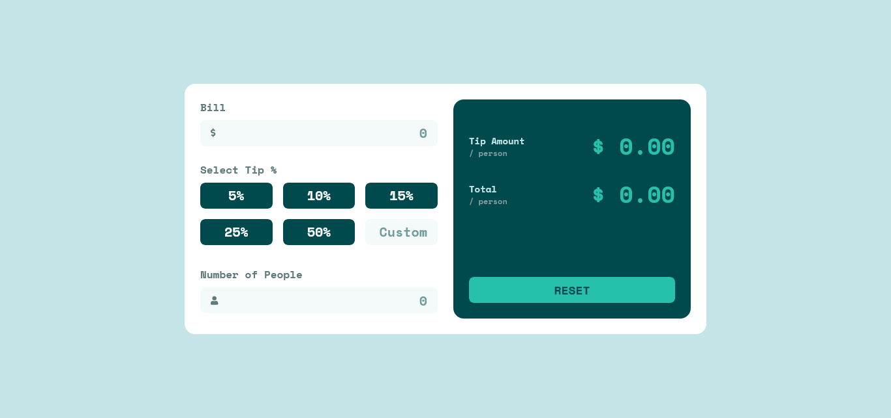
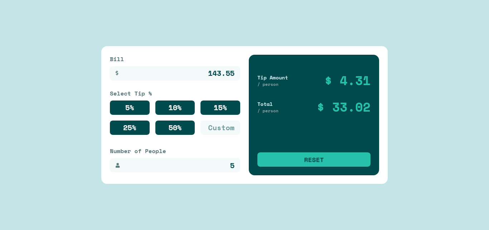

# Frontend Mentor - Tip calculator app solution

This is a solution to the [Tip calculator app challenge on Frontend Mentor](https://www.frontendmentor.io/challenges/tip-calculator-app-ugJNGbJUX). Frontend Mentor challenges help you improve your coding skills by building realistic projects.

## Table of contents

- [Overview](#overview)
    - [The challenge](#the-challenge)
    - [Screenshot](#screenshot)
    - [Links](#links)
- [My process](#my-process)
    - [Built with](#built-with)
    - [What I learned](#what-i-learned)
- [Author](#author)

**Note: Delete this note and update the table of contents based on what sections you keep.**

## Overview

### The challenge

Users should be able to:

- View the optimal layout for the app depending on their device's screen size
- See hover states for all interactive elements on the page
- Calculate the correct tip and total cost of the bill per person

### Screenshot




### Links

- Solution URL: [Add solution URL here](https://github.com/WalterKstro/tip-calculator-app-challenge)
- Live Site URL: [Add live site URL here](https://walterkstro.github.io/tip-calculator-app-challenge/)

## My process

### Built with

- Semantic HTML5 markup
- CSS custom properties
- Flexbox
- CSS Grid
- Mobile-first workflow
- [Vue.js](https://vuejs.org/) - Framework Js

### What I learned

Use the watchers and filters of Vue.js and `$ref` for reference to an element or a child component

```js
<!-- vm.$refs.p will be the DOM node -->
<p ref="p">hello</p>

```

## Author

- Website - [It's in building](https://www.your-site.com)
- Frontend Mentor - [@WalterKstro](https://www.frontendmentor.io/profile/WalterKstro)
- Twitter - [@fckastro](https://twitter.com/fckastro)
